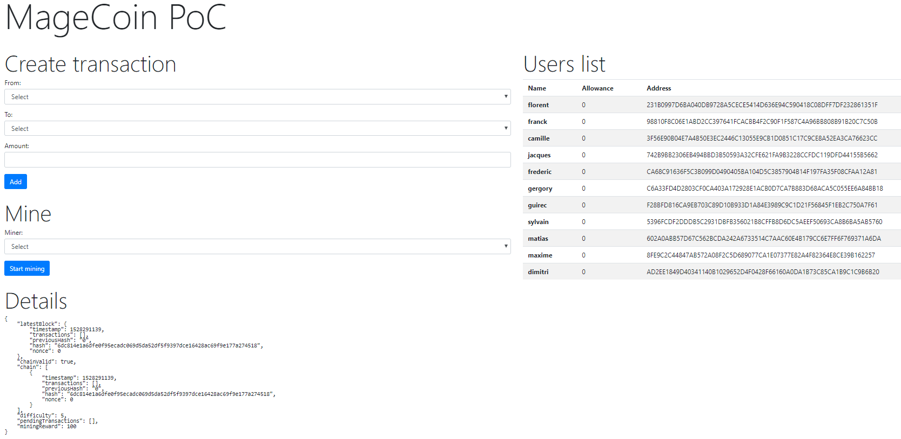

# MAGECOIN - simple blockchain exemple with php

[](https://packagist.org/packages/opengento/module-gdpr)
[](./LICENSE) 


Exemple allows customers to transfer ammount, mine, and show blockchain data.


## Setup

Composer are required.


### Get the package

Unzip the package.


### Install

```
composer install
vagrant up
```

and go to : [http://10.33.33.33/](http://10.33.33.33/)

## Usage

- Create transaction each other.

- Mine next block.

- Show chain data update

- Refresh page to update allowance

## Picture



## Settings

Blockchain is stored in your session.
To configure chain, go to Chain.php

## Support

- Raise a new [request](https://github.com/opengento/magecoin/issues) on the issue tracker.

## Authors

- **Opengento Community** - *Lead* - [They're awesome!](https://github.com/opengento)
- **Contributors** - *Contributor* - [Many thanks!](https://github.com/opengento/magecoin/graphs/contributors)

## Todo 

- ERC20 compliant

## Licence

This project is licensed under the MIT License - see the [LICENSE](./LICENSE) details.

***That's all folks!***